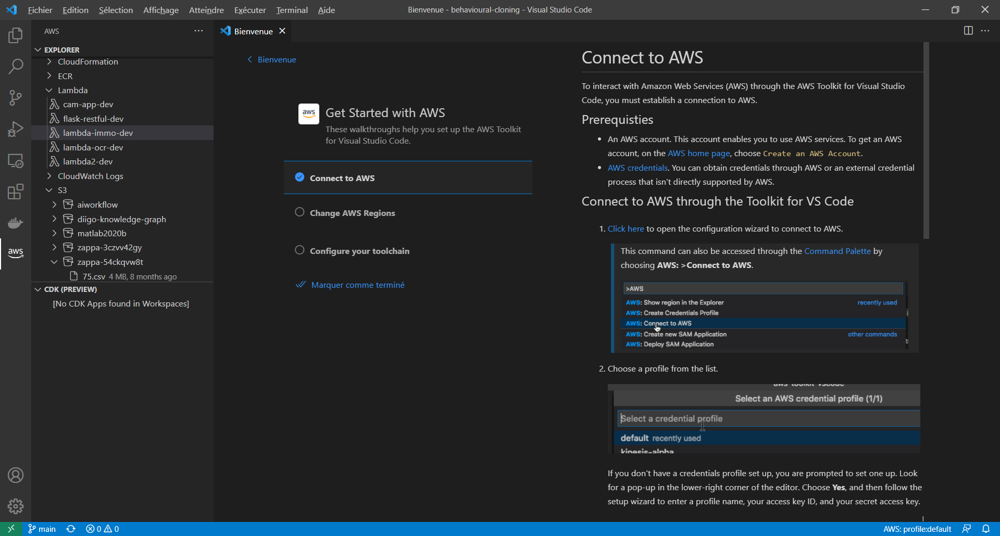

# Lambda boto + Zappa App

Call AWS ressources with the boto3 Python library out of a Flask server deployed with Zappa on as lambda function:
https://zuf9du7nyf.execute-api.eu-west-3.amazonaws.com/dev

The bucket created by Zappa and called for test is:
s3://zappa-w6lpl9cl0

```
$ flask routes
Endpoint    Methods  Rule
----------  -------  ------------------------------
file_list   GET      /list/<bucket>
file_read   GET      /list/<bucket>/read/<filename>
hello_boto  GET      /
static      GET      /static/<path:filename>
```

## Zappa App #1: Get Paris weather and write to S3 file

This example makes a request to the openweathermap API and saves the result to a file on the S3 bucket:

[README.md](zappa_app/README.md)

Dev version available here:
https://dgpt7b34uf.execute-api.us-east-1.amazonaws.com/dev

## Zappa App #2: Get Paris real estate prices

This example serves a dataset of real estate prices in Paris by parsing the "code_commune" parameter of the URL:
https://26yrburrn0.execute-api.eu-west-3.amazonaws.com/dev/dvf?code_commune=75114

Find out more:
https://github.com/slevin48/lambda-immo

## Manage AWS from VScode

